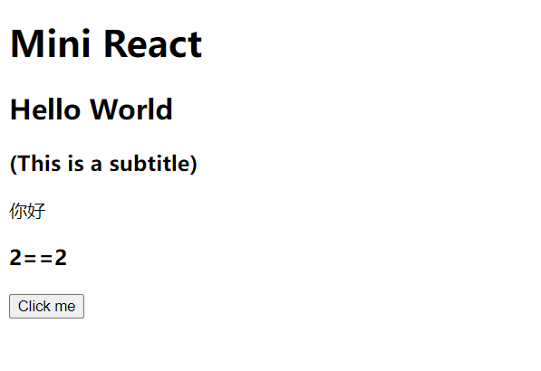
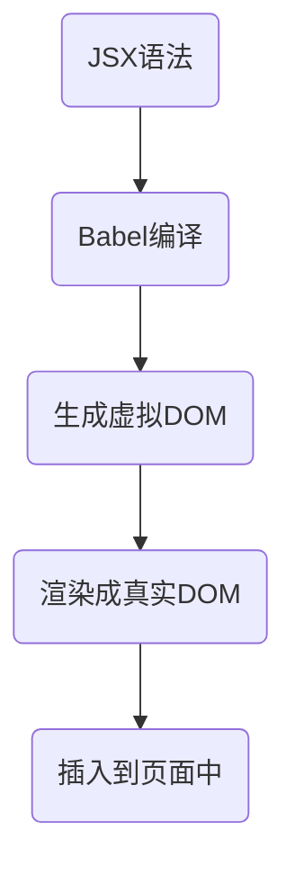
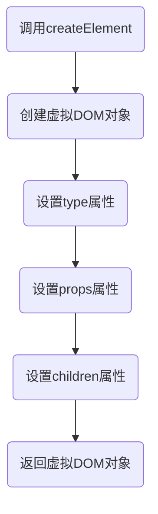
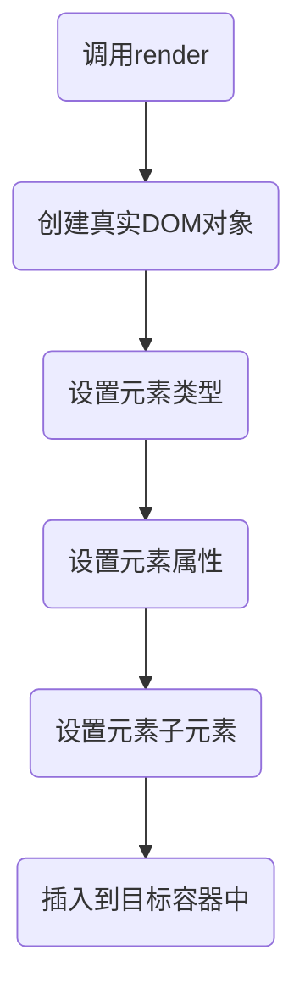

# 虚拟 DOM

> 本章节对应分支 [01.virtualDom](https://github.com/inannan423/mini-react/tree/01.virtualDom)

本章开始实现一个 Mini React。

## Create Element

创建一个新的文件，命名为 `createElement.js`，根据上一章我们分析可知，一个 JSX 对象会被编译成一个 `React.createElement()` 方法的调用，它是这样的：

```js[02.virtualdom.md](02.virtualdom.md)
const element = React.createElement(
  "h1",
  null,
  "Hello, world!"
);
```

它生成的是一个对象：

```
{
    type: 'h1',
    props: null,
    children: 'Hello, world!'
}
```

分析可知，它接收三个参数，也就是我们需要实现的 `createElement()` 方法的参数，分别是：

- `type`：元素类型，他是一个字符串，指明了元素的类型，比如 `div`、`span`、`h1` 等等
- `props`：元素的属性，它是一个对象，包含了元素的所有属性，比如 `id`、`className`、`style` 等等
- `children`：元素的子元素，它是一个数组，包含了元素的所有子元素

```js
export default function createElement(type, props, ...children) {
    return {
        type,
        props,
        children
    }
}
```

然后在 `index.js` 中导出：

```js
import createElement from "./createElement";

export default {
    createElement
}
```

接着在外部的 `index.js` 中测试一下：

```js
import MiniReact from './MiniReact'

const virtualDOM = (
    <div className="container">
        <h1>Mini React</h1>
        <h2>Hello World</h2>
        <h3>(This is a subtitle)</h3>
        你好
        {2==1 && <h3>2==1</h3>}
        {2==2 && <h3>2==2</h3>}
        <button onClick={() => alert('Hi')}>Click me</button>
    </div>
);


console.log(virtualDOM);
```

JS 执行到这里的时候，Babel 会自动查找 MiniReact 中的 `createElement()` 方法，然后生成一个对象，生成结果如下：  

```js
{
    "type": "div",
    "props": {
        "className": "container"
    },
    "children": [
        {
            "type": "h1",
            "props": null,
            "children": [
                "Mini React"
            ]
        },
        {
            "type": "h2",
            "props": null,
            "children": [
                "Hello World"
            ]
        },
        {
            "type": "h3",
            "props": null,
            "children": [
                "(This is a subtitle)"
            ]
        },
        "你好",
        false,
        {
            "type": "h3",
            "props": null,
            "children": [
                "2==2"
            ]
        },
        {
            "type": "button",
            "props": {},
            "children": [
                "Click me"
            ]
        }
    ]
}
```
但是我们可以发现一些问题：  

- 文字节点显示为了一个字符串，而不是一个节点对象。
- 布尔值 `false` 也被当成了一个节点。

因此我们需要对 `createElement()` 方法进行改造，使其能够处理这些问题。

我们先对 children 进行拷贝，使用数组的 concat 方法构造一个新的数组，对数组使用 map 进行遍历，对每个元素进行处理，如果是一个对象，直接返回，如果是一个字符串，就返回一个新的对象，这个对象就是一个文本节点对象，它的 type 是 `text`，props 是一个对象，包含了 `textContent` 属性，值就是这个字符串。文字节点没有子元素，所以 `childElements` 为空。

```js
export default function createElement(type, props, ...children) {
    // 拷贝 children 数组进行处理
    const childElements = [].concat(...children).map(child => {
        if (child instanceof Object) {
            return child
        } else {
            return createElement("text", {
                textContent: child
            })
        }
    })
    return {
        type,
        props,
        childElements
    }
}
```

> 小记：`concat()` 方法用于连接两个或多个数组。此方法不会更改现有数组，而是返回一个新数组。`map` 方法创建一个新数组，其结果是该数组中的每个元素都调用一个提供的函数后返回的结果。也是不会改变原数组，而是返回一个新数组。

我们进入浏览器查看变化。  

```js
{
    "type": "div",
    "props": {
        "className": "container"
    },
    "children": [
        {
            "type": "h1",
            "props": null,
            "children": [
                {
                    "type": "text",
                    "props": {
                        "textContent": "Mini React"
                    },
                    "children": []
                }
            ]
        },
        {
            "type": "h2",
            "props": null,
            "children": [
                {
                    "type": "text",
                    "props": {
                        "textContent": "Hello World"
                    },
                    "children": []
                }
            ]
        },
        {
            "type": "h3",
            "props": null,
            "children": [
                {
                    "type": "text",
                    "props": {
                        "textContent": "(This is a subtitle)"
                    },
                    "children": []
                }
            ]
        },
        {
            "type": "text",
            "props": {
                "textContent": "你好"
            },
            "children": []
        },
        {
            "type": "text",
            "props": {
                "textContent": false
            },
            "children": []
        },
        {
            "type": "h3",
            "props": null,
            "children": [
                {
                    "type": "text",
                    "props": {
                        "textContent": "2==2"
                    },
                    "children": []
                }
            ]
        },
        {
            "type": "button",
            "props": {},
            "childElements": [
                {
                    "type": "text",
                    "props": {
                        "textContent": "Click me"
                    },
                    "children": []
                }
            ]
        }
    ]
}
```
可以看到这时我们的文字节点也被处理成了对象。但是令人注意的是：  

```js
{
    "type": "text",
    "props": {
        "textContent": false
    },
    "children": []
},
```

我们的 `false` 也被当成了一个节点，这是不对的，因为 `false` 是一个布尔值，不应该被当成一个节点。因此我们需要对 `createElement()` 方法再次进行改造。

由于我们需要筛选返回值而不是全量返回，所以不能使用 map 方法了，我们可以使用 reduce 方法。

```js
const childElements = [].concat(...children).reduce((result , child) => {
        if (child !== false && child !== true && child !== null) {
            if (child instanceof Object) {
                result.push(child)
            } else {
                result.push(createElement('text', {
                    textContent: child
                }))
            }
        }
        return result
    },[])
```
> 小记：`reduce()` 方法接收一个函数作为累加器，第二个参数为初始值。

```js
const arr = [1, 2, 3, 4, 5];
const sum = arr.reduce((accumulator, currentValue) => accumulator + currentValue, 0);
console.log(sum); // 15
```
在新的 `createElement` 方法中，我们将 `false`、`true`、`null` 过滤掉了，然后再进行处理。  

```js
{
    "type": "div",
    "props": {
        "className": "container"
    },
    "children": [
        {
            "type": "h1",
            "props": null,
            "children": [
                {
                    "type": "text",
                    "props": {
                        "textContent": "Mini React"
                    },
                    "children": []
                }
            ]
        },
        {
            "type": "h2",
            "props": null,
            "children": [
                {
                    "type": "text",
                    "props": {
                        "textContent": "Hello World"
                    },
                    "children": []
                }
            ]
        },
        {
            "type": "h3",
            "props": null,
            "children": [
                {
                    "type": "text",
                    "props": {
                        "textContent": "(This is a subtitle)"
                    },
                    "children": []
                }
            ]
        },
        {
            "type": "text",
            "props": {
                "textContent": "你好"
            },
            "children": []
        },
        {
            "type": "h3",
            "props": null,
            "children": [
                {
                    "type": "text",
                    "props": {
                        "textContent": "2==2"
                    },
                    "children": []
                }
            ]
        },
        {
            "type": "button",
            "props": {},
            "children": [
                {
                    "type": "text",
                    "props": {
                        "textContent": "Click me"
                    },
                    "children": []
                }
            ]
        }
    ]
}
```
最终生成的对象中我们可以看到， `true`、`false`、`null` 都被过滤掉了。

在 React 中，我们是可以使用 props.children 来获取子节点的，但是在我们的 Mini React 中，我们是通过 children 来获取子节点的。因此我们需要对返回值进行改造。

```js
return {
    type,
    props: Object.assign({ children: childElements }, props),
    children: childElements
}
```

> 小记：`Object.assign()` 方法用于将所有可枚举属性的值从一个或多个源对象复制到目标对象。它将返回目标对象。

```js
const target = { a: 1, b: 2 };
const source = { b: 4, c: 5 };
const returnedTarget = Object.assign(target, source);
console.log(returnedTarget); // { a: 1, b: 4, c: 5 }
```
这样我们就可以从 props 中拿到 children 了。

```js
{
    "type": "h1",
    "props": {
        "children": [
            {
                "type": "text",
                "props": {
                    "children": [],
                    "textContent": "Mini React"
                },
                "children": []
            }
        ]
    },
    "children": [
        {
            "type": "text",
            "props": {
                "children": [],
                "textContent": "Mini React"
            },
            "children": []
        }
    ]
}
```
输出的虚拟 DOM 过于长，我们就不贴了。

## render

我们需要使用 `render` 方法将虚拟 DOM 渲染转化为真实 DOM 并渲染到页面上。


render 方法接收两个参数：

- virtualDOM：虚拟 DOM 对象
- container：容器

```js
const root = document.getElementById('root');
MiniReact.render(virtualDOM, root);
```
但是我们还必须考虑页面中是否有旧的 DOM 对象。这里我们使用 diff 方法来判断是否是更新操作。

```js
export default function render(virtualDOM, container,oldDOM){
    diff(virtualDOM,container,oldDOM)   // 判断是否是更新操作
}
```

新建 `diff.js` 文件，用于判断是否是更新操作。

在 Diff 中，我们需要判断是 DOM 对象还是组件对象。例如 JSX 可能由多个组件组成，我们需要判断是否是组件对象。

```jsx
<div>
    <Counter />
    <div>hello world</div>
</div>
```

我们创建 mountElement 方法，用于处理 DOM 对象。在这个方法中，我们去判断是否是组件对象，如果是组件对象，我们就调用 mountComponent 方法，如果不是组件对象，我们就调用 mountNativeElement 方法。

```js
export default function mountElement(virtualDOM, container, oldDOM) {
     mountNativeElement(virtualDOM, container, oldDOM);
}
```

不过这里我们暂且只处理 DOM 对象，所以我们先创建 mountNativeElement 方法。

```js
export default function mountNativeElement(virtualDOM, container, oldDOM) {
    let newElement = null;  // 创建新的DOM对象
    // 如果类型是文本
    if (virtualDOM.type === 'text') {
        newElement = document.createTextNode(virtualDOM.props.textContent);
    } else {
        // 如果类型不是文本,就是一个标签
        newElement = document.createElement(virtualDOM.type);
    }
}
```

到目前为止，我们创建了顶层的 DOM 对象，但是我们还没有处理子节点。我们需要遍历子节点，然后递归调用 mountElement 方法。

```js
export default function mountNativeElement(virtualDOM, container, oldDOM) {
    // ...
    // 递归地渲染子节点
    virtualDOM.children.forEach(child => mountElement(child, newElement));
}
```
接着我们需要将转换后的 DOM 对象插入到页面中。

```js
container.appendChild(newElement);
```
运行我们的代码，打开浏览器可以看到我们的页面已经渲染出来了。



创建 DOM 这个方法是可以复用的，因此我们可以把创建 DOM 的方法抽离出来。

```js
import mountElement from "./mountElement";

export default function mountNativeElement(virtualDOM) {
    let newElement = null;  // 创建新的DOM对象
    // 如果类型是文本
    if (virtualDOM.type === 'text') {
        newElement = document.createTextNode(virtualDOM.props.textContent);
    } else {
        // 如果类型不是文本,就是一个标签
        newElement = document.createElement(virtualDOM.type);
    }
    // 递归地渲染子节点
    virtualDOM.children.forEach(child => mountElement(child, newElement));
    return newElement;
}
```

## 为真实 DOM 对象添加属性

虽然我们已经创建了真实 DOM 对象，但是我们还没有为真实 DOM 对象添加属性。我们需要遍历属性对象，然后为真实 DOM 对象添加属性。

这些属性都被存储在 `virtualDOM.props` 中，我们需要遍历这个对象，然后为真实 DOM 对象添加属性。

当然这里有多种不同的情况需要考虑，例如：  

- 事件属性
- className
- value、checked

我们在 `mountNativeElement` 方法中添加属性的逻辑。

```js
export default function mountNativeElement(virtualDOM) {
        // ...
        // 如果类型不是文本,就是一个标签
        newElement = document.createElement(virtualDOM.type);
        // 为元素添加属性
        updateNodeElement(newElement, virtualDOM);
    }
    // ...
}
```

它接收两个参数，第一个参数是真实 DOM 对象，第二个参数是虚拟 DOM 对象。

```jsx
export default function updateNodeElement (newElement,virtualDom) {
    const newProps = virtualDom.props || {};
    Object.keys(newProps).forEach(propName => {
        const newPropsValue = newProps[propName];
        // 判断是否是事件属性
        if (propName.slice(0,2) === 'on') {
            // 事件名称，事件名是小写 onClick -> click
            const eventName = propName.toLowerCase().slice(2);
            // 为元素添加事件
            newElement.addEventListener(eventName, newPropsValue);
        } else if (propName === 'value' || propName === 'checked') {
            // 如果是 value 或者 checked 属性，直接赋值
            newElement[propName] = newPropsValue;
        } else if (propName !== 'children') {
            // 如果属性名不是 children，就是普通属性，直接赋值
            if (propName === 'className') {
                // 如果属性名是 className，改为 class
                newElement.setAttribute('class', newPropsValue);
            } else {
                newElement.setAttribute(propName, newPropsValue);
            }
        }
    });
}
```

在这个函数中，我们考虑了多种情况：  

- 事件属性，事件属性通常是以 `on` 开头的，例如 `onClick`，我们需要将事件名转换为小写，然后为真实 DOM 对象添加事件。
- `value`、`checked` 属性，这些属性是特殊的属性，我们需要直接赋值。
- `className` 属性，我们需要将 `className` 转换为 `class`。
- 去除了 `children` 属性，因为 `children` 属性是用来存储子节点的，我们不需要为真实 DOM 对象添加 `children` 属性。

## 总结

>以下内容由 ChatGPT 生成

在 Mini React 中，我们使用 JSX 语法来描述虚拟 DOM，然后通过 Babel 编译成 JavaScript 代码。在编译过程中，Babel 会自动查找 MiniReact 中的 createElement() 方法，然后生成一个对象，这个对象就是我们的虚拟 DOM。最后，我们将虚拟 DOM 渲染成真实的 DOM，并将其插入到页面中。

下面是 Mini React 的完整流程图：



以上是 Mini React 的完整流程，其中最重要的部分就是生成虚拟 DOM。在 Mini React 中，我们使用 createElement() 方法来生成虚拟 DOM。这个方法接收三个参数，分别是元素类型、元素属性和元素子元素。我们可以将这个方法看作是一个工厂方法，用来创建虚拟 DOM 对象。

下面是 createElement() 方法的流程图：




以上是 createElement() 方法的流程，其中最重要的部分就是设置虚拟 DOM 对象的属性。在 Mini React 中，我们使用一个对象来表示虚拟 DOM，这个对象包含了元素类型、元素属性和元素子元素。我们可以将这个对象看作是一个树形结构，其中每个节点都是一个虚拟 DOM 对象。

最后，我们需要将虚拟 DOM 渲染成真实的 DOM，并将其插入到页面中。在 Mini React 中，我们使用 render() 方法来完成这个任务。这个方法接收两个参数，分别是虚拟 DOM 和目标容器。我们可以将这个方法看作是一个工厂方法，用来创建真实的 DOM 对象。

下面是 render() 方法的流程图：



以上是 Mini React 的完整流程图，包括了生成虚拟 DOM 和渲染成真实 DOM 两个部分。通过这个流程图，我们可以更好地理解 Mini React 的工作原理。
