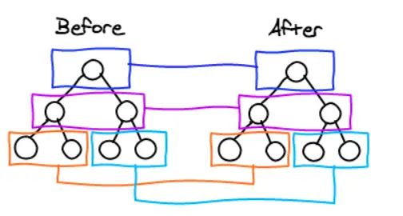

# 更新虚拟 DOM

> 本章节对应分支 [03.updateVirtualDom](https://github.com/inannan423/mini-react/tree/03.updateVirtualDom)

接下来我们需要更新虚拟 DOM，我们在 index.js 中创建两个 JSX 结构，然后调用 render 函数：

```jsx
const vdom = (
    <div className="container">
        <h1 data-title="hello">你好</h1>
        <span>Mini React</span>
    </div>
);

const modifiedVdom = (
    <div className="container">
        <h1 data-title="world">你好</h1>
        <span>Mini React Modified</span>
    </div>
);

MiniReact.render(vdom, document.getElementById('root'));

setTimeout(() => {
    MiniReact.render(modifiedVdom, document.getElementById('root'));
}, 3000);
```
在上面的代码中，我们创建了两个虚拟 DOM，然后调用 render 函数，然后 3 秒后再次调用 render 函数，以测试我们的更新虚拟 DOM 的方法。

## 存储旧的虚拟 DOM

我们可以在 createDOMElement.js 中，为每次生成的 newElement 添加一个属性，这个属性就是旧的虚拟 DOM，这样我们就可以在更新虚拟 DOM 的时候，拿到旧的虚拟 DOM。

```js
// 存储旧的虚拟DOM
newElement._virtualDOM = virtualDOM;
```
因此，我们可以在 render 中获取到旧的虚拟 DOM：

```js
export default function render(virtualDOM, container,oldDOM = container.firstChild){
    diff(virtualDOM,container,oldDOM)  
}
```
为什么是 `container.firstChild` 呢？因为我们在 `index.js` 中，调用 `render` 函数的时候，第三个参数是 `document.getElementById('root')`，而 `document.getElementById('root')` 的第一个子节点就是我们的 `container`。也就是我们的虚拟 dom 转真实 dom 的结果。

然后我们去 diff 中进行处理：

```js
export default function diff(virtualDOM, container, oldDOM) {
    const oldVirtualDOM = oldDOM && oldDOM._virtualDOM;    // 获取旧的虚拟DOM对象
    if (!oldDOM) {  // 如果没有旧的DOM对象，直接渲染
        mountElement(virtualDOM, container, oldDOM);    // 挂载新的DOM对象
    }
}
```
我们要分多种情况进行 diff：

- 要对比的元素是类型相同的元素
- 要对比的元素是类型不同的元素

### 类型相同的元素

如果两个元素类型相同，如果是文字节点，我们只需要更新文本内容即可，如果是原生节点，我们需要更新属性。

```js
export default function diff(virtualDOM, container, oldDOM) {
    const oldVirtualDOM = oldDOM && oldDOM._virtualDOM;    // 获取旧的虚拟DOM对象
    if (!oldDOM) {  // 如果没有旧的DOM对象，直接渲染
        mountElement(virtualDOM, container, oldDOM);    // 挂载新的DOM对象
    } else if (oldVirtualDOM && oldVirtualDOM.type === virtualDOM.type) {  // 如果新旧虚拟DOM对象类型相同
        // 更新操作,如果是文本类型的节点，只需要更新文本内容
        if (oldVirtualDOM.type === "text") {
            // 更新文本内容,三个参数，将差异更新到旧的DOM对象上（第三个参数）
            updateTextNode(virtualDOM, oldVirtualDOM, oldDOM);
        } else {
            // 更新元素属性
        }
    }
}
```
`updateTextNode` 函数：

```js
export default function updateTextNode(virtualDOM, oldVirtualDOM, oldDOM) {
    if (virtualDOM.props.textContent !== oldVirtualDOM.props.textContent) {
        oldDOM.textContent = virtualDOM.props.textContent;
        oldDOM._virtualDOM = virtualDOM;
    }
}
```
这个函数中，我们对比了新旧虚拟 DOM 的文本内容，如果不一样，我们就更新旧的 DOM 对象的文本内容，然后更新旧的虚拟 DOM。

我们现在仅仅对比了最外层的元素，我们需要对比所有的元素，所以我们需要递归调用 diff 函数：

```js
// diff...
// 递归更新子节点
virtualDOM.children.forEach((child, i) => {
    diff(child, oldDOM, oldDOM.childNodes[i]);
});
```
现在打开浏览器，初始时，我们的页面是这样的：

```
你好
Mini React
```

然后 3 秒后，我们的页面变成了这样：

```
你好
Mini React Modified
```
我们可以看到，我们的页面已经更新了。

接下来要对比的是元素的属性，回到 `diff` 函数中：

```js
if (oldVirtualDOM.type === "text") {
    // 更新文本内容,三个参数，将差异更新到旧的DOM对象上（第三个参数）
    updateTextNode(virtualDOM, oldVirtualDOM, oldDOM);
} else {
    // 更新元素属性
    updateNodeElement(oldDOM, virtualDOM, oldVirtualDOM);
}
```

实际上，这个 updateNodeElement 已经在之前的章节中实现了，但我们需要对其进行修改。

```js
export default function updateNodeElement (newElement,virtualDom,oldVirtualDom = {}) {
    const newProps = virtualDom.props || {};
    // 获取旧的属性对象
    const oldProps = oldVirtualDom.props || {};
    Object.keys(newProps).forEach(propName => {
        // 获取新的属性值
        const newPropsValue = newProps[propName];
        // + 获取旧的属性值
        const oldPropsValue = oldProps[propName];
        // + 更新
        if (newPropsValue !== oldPropsValue) {
            // 判断是否是事件属性
            if (propName.slice(0,2) === 'on') {
                // 事件名称，事件名是小写 onClick -> click
                const eventName = propName.toLowerCase().slice(2);
                // 为元素添加事件
                newElement.addEventListener(eventName, newPropsValue);

                // + 移除旧的事件
                if (oldPropsValue) {
                    // 移除旧的事件
                    newElement.removeEventListener(eventName, oldPropsValue);
                }

            } else if (propName === 'value' || propName === 'checked') {
                // 如果是 value 或者 checked 属性，直接赋值
                newElement[propName] = newPropsValue;
            } else if (propName !== 'children') {
                // 如果属性名不是 children，就是普通属性，直接赋值
                if (propName === 'className') {
                    // 如果属性名是 className，改为 class
                    newElement.setAttribute('class', newPropsValue);
                } else {
                    newElement.setAttribute(propName, newPropsValue);
                }
            }
        }

        // 判断属性被删除的情况
        Object.keys(oldProps).forEach(propName => {
            const newPropsValue = newProps[propName];
            // 值不存在则说明属性被删除
            if (!newPropsValue) {
                // 判断是否是事件属性
                if (propName.slice(0,2) === 'on') {
                    // 事件名称，事件名是小写 onClick -> click
                    const eventName = propName.toLowerCase().slice(2);
                    // 移除旧的事件
                    newElement.removeEventListener(eventName, oldPropsValue);
                }
                // 这里就不用讨论 value 和 checked 了，因为这两个属性可以被 removeAttribute 删除
                else if (propName !== 'children') {
                    // 如果属性名不是 children，就是普通属性，直接赋值
                    if (propName === 'className') {
                        // 如果属性名是 className，改为 class
                        newElement.removeAttribute('class');
                    } else {
                        newElement.removeAttribute(propName);
                    }
                }
            }
        })

    });
}
```

在这一块代码中，我们对比了新旧虚拟 DOM 的属性，如果不一样，我们就更新旧的 DOM 对象的属性，然后更新旧的虚拟 DOM。考虑了两种情况：

- 新旧属性都存在，且值不一样
- 新属性不存在，旧属性存在

我们再来测试一下：  

```js
const vdom = (
    <div className="container">
        <h1 data-title="hello">你好</h1>
        <span>Mini React</span>
        <button onClick={() => alert('Hi')}>Click me</button>
    </div>
);

const modifiedVdom = (
    <div className="container">
        <h1 data-title="world">你好</h1>
        <span>Mini React Modified</span>
        <button onClick={() => alert('你好')}>Click me</button>
    </div>
);
```

得到的结果是，页面初始化时，显示的是：

```
你好
Mini React
```

点击按钮显示 Hi。

3 秒后，页面变成了：

```
你好
Mini React Modified
```

点击按钮显示 你好。
 
因此我们可以总结出**类型相同**的情况下，vdom 的比对策略，即：

- 如果是文本节点。就只比对文本内容是否一致，不一致就更新。
- 如果是元素节点。就比对元素的属性是否一致，不一致就更新。
- 如果有节点被删除（即用旧节点的属性名称去新节点中取值，取不到值），就删除该节点。

vdom 比对时是**深度优先**的，即先比对最外层的节点，然后再比对子节点。这与我们代码中的循环体中递归 diff 对应。

```js
// diff...
else if (oldVirtualDOM.type === virtualDOM.type) {
    // 递归更新子节点
    virtualDOM.children.forEach((child, i) => {
        diff(child, oldDOM, oldDOM.childNodes[i]);
    });
}
```

用图示的方式来表示，如下：

```
            ul(1)
        /       |       \
    li(2)     li(3)     li(4)
    /   \     /   \     /   \
    a(5)  a(6) a(7) a(8) a(9) a(10)
```

在这个例子中，我们先比对 ul(1) ,然后再比对 li(2)节点，然后发现 li(2) 拥有子节点，那么就比对 li(2) 的子节点 a(5)。此时，a(5) 没有子节点，所以就比对 a(6)。待 a(10) 比对完后跳回到 li(3)。以此类推，直到比对完所有节点。



## 比对节点类型不同的情况

在上一节中，我们讨论了类型相同的情况，那么类型不同的情况呢？

**实际上，这就不需要进行比对了，我们只需要将新的对象替换旧的对象即可。**

```js
if (!oldDOM) {  // 如果没有旧的DOM对象，直接渲染
    mountElement(virtualDOM, container, oldDOM);    // 挂载新的DOM对象
} else if (virtualDOM.type !== oldVirtualDOM.type && typeof virtualDOM.type !== "function") {  // 如果新旧虚拟DOM对象类型不同，直接替换
    // 如果新旧虚拟DOM对象类型不同，直接替换
    const newElement = createDOMElement(virtualDOM);    // 创建新的DOM对象
    oldDOM.parentNode.replaceChild(newElement, oldDOM);    // 替换旧的DOM对象
} else if (oldVirtualDOM && oldVirtualDOM.type === virtualDOM.type) {  // 如果新旧虚拟DOM对象类型相同 ...
}
```
在这里，我们为新的 vdom 创建了一个 DOM 对象，然后用新的 DOM 对象替换旧的 DOM 对象。这样就完成了类型不同的情况的处理。

我们创建一个测试的例子：  

```js
const vdom = (
    <div className="container">
        <h1 data-title="hello">你好</h1>
        <span>Mini React</span>
        <button onClick={() => alert('Hi')}>Click me</button>
    </div>
);

const modifiedVdom = (
    <ul className="container">
        <li>你好</li>
        <input type="text" value="Mini React" />
        <li><button onClick={() => alert('你好吗')}>Click me</button></li>
    </ul>
);
```

得到的结果是，页面初始化时，显示的是：

```
你好
Mini React
```

点击按钮显示 Hi。

3 秒后，页面变成了：

```
你好
输入框
```

点击按钮显示 你好吗。

## 删除节点

```html
<ul>             ←   <ul>
    <li>1</li>   ←     <li>1</li>
    <li>2</li>   ←     <li>3</li>
    <li>3</li>   ←     <li>4</li>
    <li>4</li>   ←     <li>5</li>
    <li>5</li>   ←   <ul>
</ul>
```

对于上面这个例子中，顶层的 ul 会进行比对，比对完之后，开始比对 li1,一致，则不更新，然后比对 li2，发现新的节点的文字属性更新了，因此修改其文字内容，然后比对 li3，发现新的节点的文字属性更新了，因此修改其文字内容，然后比对 li4，发现新的节点的文字属性更新了，因此修改其文字内容，然后比对 li5，发现新的 vdom 中没有 li5，因此删除 li5。

因此如果旧节点的数量大于新节点的数量，那么就需要删除多余的节点。

```js
// diff...
else
if (oldVirtualDOM && oldVirtualDOM.type === virtualDOM.type) {  
    // ...
    // 删除多余的子节点
    const oldChildNodes = oldDOM.childNodes;
    if (oldChildNodes.length > virtualDOM.children.length) {
        for (let i = oldChildNodes.length - 1; i > virtualDOM.children.length - 1; i--) {
            unMountNode(oldChildNodes[i]);
        }
    }
}

// unMountNode
function unMountNode(node) {
    node.remove();
}
```
不加这个删除逻辑时，新的 vdom 无法让多余的节点消失，因为我们只是更新了节点的属性，而没有删除节点。
